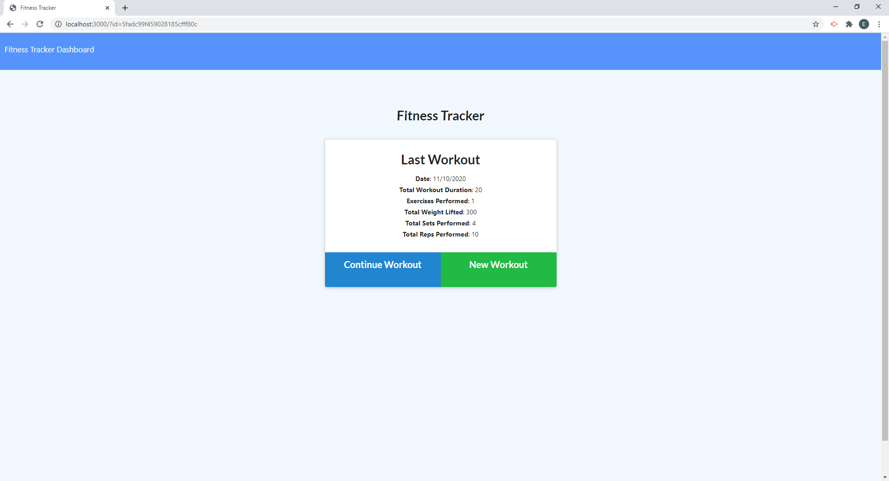
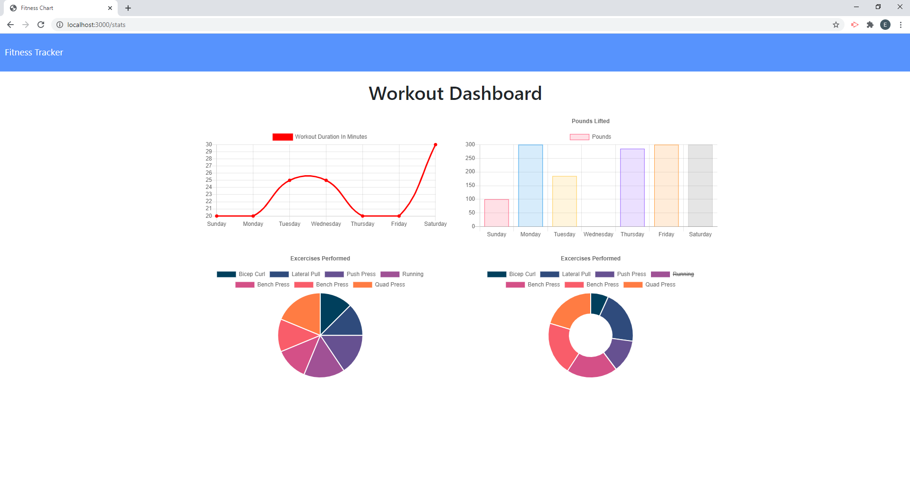

  # Workout Tracker

  ## Description
  A fitness app that allows the user to view, create, and track daily workouts. The user is able to log multiple exercises in a given day and also go back and update the workout. The user is able to track the name, type, weight, sets, reps and duration of each exercise. Cardiovascular exercises show the distance traveled in miles.

  ## Table of Contents
  1. [Description](#description)
  2. [Installation](#installation)
  3. [Usage](#usage)
  4. [License](#license)
  5. [Contributing](#contributing)
  6. [Tests](#tests)
  7. [Questions](#questions)

  ## Installation
  Node.js is required on your machine, otherwise run "npm install" from the integrated terminal.

  ## Usage
  Homepage
  
   
  Statistics Page
  

  ## License
  This application is licensed under the None license.

  ## Contributing
  This project is not open to contributions at this time.

  ## Tests
  There is no test suite for this application, manual test were run to ensure functionality.

  ## Questions
  <a href="https://github.com/Mcduderson">GitHub Profile</a>
   
  For questions I can be reached at e.payne000@gmail.com
   
  <a href="">Deployed Application</a>